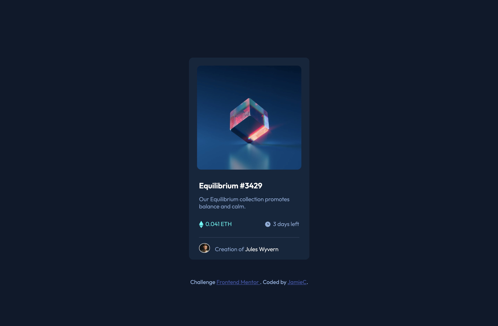
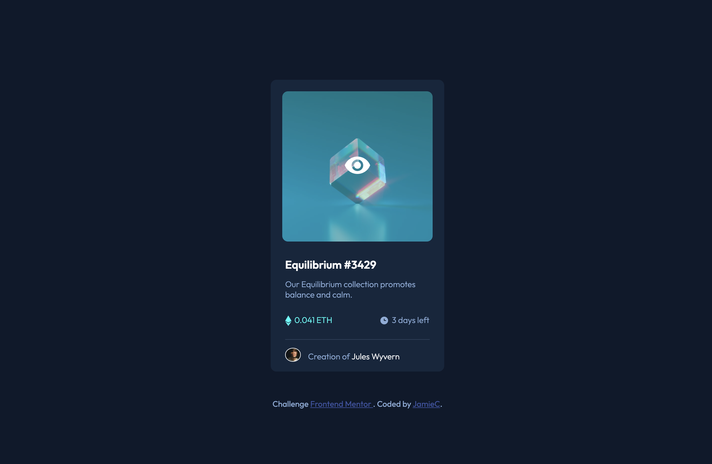
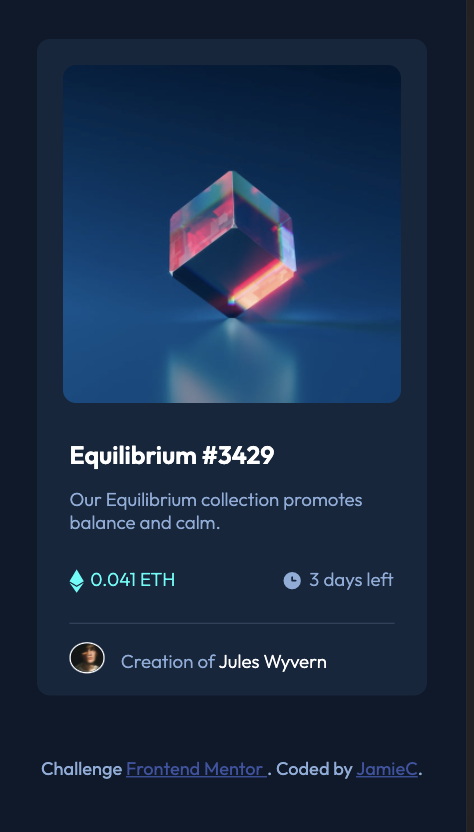

# Frontend Mentor - NFT preview card component solution

This is a solution to the [NFT preview card component challenge on Frontend Mentor](https://www.frontendmentor.io/challenges/nft-preview-card-component-SbdUL_w0U). Frontend Mentor challenges help you improve your coding skills by building realistic projects.

## Table of contents

- [Overview](#overview)
  - [The challenge](#the-challenge)
  - [Screenshot](#screenshot)
  - [Links](#links)
- [My process](#my-process)
  - [Built with](#built-with)
  - [What I learned](#what-i-learned)
  - [Continued development](#continued-development)
  - [Useful resources](#useful-resources)
- [Author](#author)
- [Acknowledgments](#acknowledgments)


## Overview

### The challenge

Users should be able to:

- View the optimal layout depending on their device's screen size
- See hover states for interactive elements

### Screenshot





### Links

- Solution URL: [Add solution URL here](https://github.com/jleegunn/NFT-preview-card)
- Live Site URL: [Add live site URL here](https://jleegunn.github.io/NFT-preview-card/)

## My process

### Built with

- Semantic HTML5 markup
- CSS custom properties
- Flexbox
- Mobile-first workflow

### What I learned

I learned how to overlay a color and image over another image, when active.

To see how you can add code snippets, see below:

```html
<div class="top_wrapper">
  
  <div class="overImg">
    
  </div>
</div>
```
```css
.overImg img {
  display: block;
  margin-left: auto;
  margin-right: auto;
  margin-top: 40%;
  opacity: 1;
}

.overImg {
  cursor: pointer;
  position: absolute;
  top: 170px;
  background-color: hsl(178, 100%, 50%, 40%);
  z-index: 1;
  opacity: 0;
  transition: opacity 0.25s;
}

.overImg:hover {
  opacity: 1;
}
```

### Useful resources

- [Example resource 1](https://www.w3schools.com/cssref/tryit.asp?filename=trycss_zindex) - This helped me understand z-index and how to use it.
- [Example resource 2](https://ducmanhphan.github.io/2019-02-18-The-difference-between-visibility-hidden-and-display-none-in-CSS/) - This is an article which helped me finally understand the difference between why you would want to use opacity:0 to capture the event rather than the other visibility options.

## Author

- Website - [Jamie Counsellor](TBD)
- Frontend Mentor - [@yourusername](https://www.frontendmentor.io/profile/@jleegunn)
